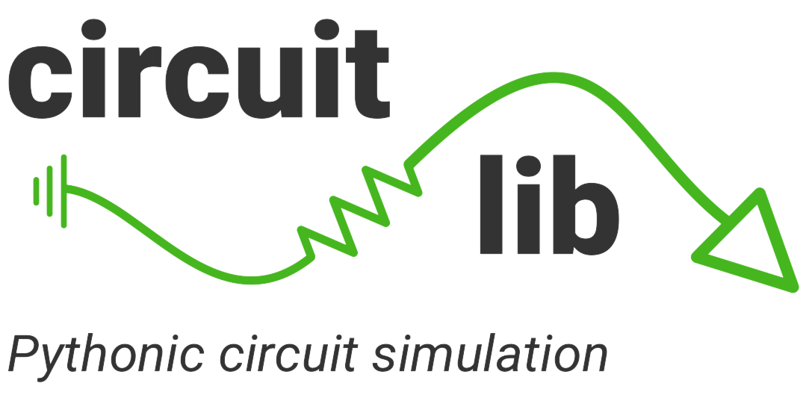

<p align="center">

</p>


# Getting started

Circuitlib allows quick and easy analysis of electrical circuits.  It is written exclusively<br/>
in Python/Cython and only requires NumPy, SciPy, and Matplotlib. Circuits can be constructed<br/>
with SPICE style netlists. Look how easy it is...

```python

import numpy as np
import circuitlib as clb

voltage = 5
inductance = 10e-3
capacitance = 1e-6
resistance = 250

netlist = clb.Netlist()
netlist.V([1,0], voltage, signal='DC')
netlist.L([1,2], inductance)
netlist.C([2,3], capacitance)
netlist.R([3,0], resistance)

time = np.linspace(0, 1e-3, 1000)

analysis = clb.ModifiedNodalAnalysis(rlc_series, time=time)
V_node2 = analysis.voltage(2, 'transient')
V_node3 = analysis.voltage(3, 'transient')
```
